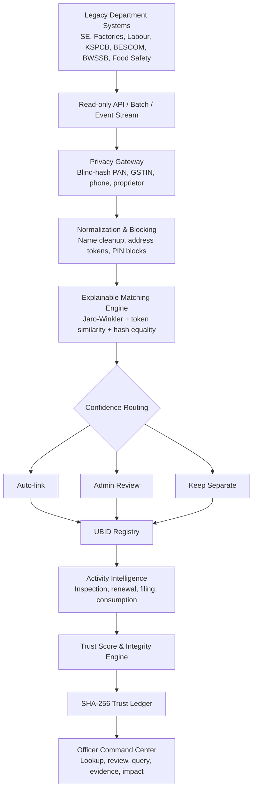

<div align="center">

# TrustID

### Adversarially Robust Unified Business Identifier & Active Business Intelligence Platform

**A privacy-preserving, explainable and audit-defensible identity intelligence layer for Karnataka's business ecosystem.**

[](https://trust-id-ubid-intelligence.vercel.app/)
[](https://trustid-ubid-intelligence.onrender.com/api/health)
[](https://react.dev/)
[](https://nodejs.org/)
[](#recognition)

<br/>


<br/>

**Independently designed and built by [Agrima Saxena](https://github.com/agrima150103) as a solo participant for the AI for Bharat Hackathon - Theme 1: Unified Business Identifier and Active Business Intelligence by Karnataka Commerce & Industry.**

</div>

---

## Recognition

> **Selected among the Top 50 teams across India from 1,000+ submissions.**

TrustID was independently developed as a **solo project** for the national-level **AI for Bharat Hackathon**, organized by the **PanIIT Bangalore Alumni Association** in association with the **Government of Karnataka**. The project addressed Theme 1 from Karnataka Commerce & Industry: building a Unified Business Identifier and Active Business Intelligence platform.

---

## The problem

Karnataka's business-facing regulatory ecosystem spans **40+ independent department systems** - including Shop Establishment, Factories, Labour, KSPCB, BESCOM, BWSSB, Fire, Food Safety and local bodies.

These systems use different schemas, department-specific record IDs and inconsistent free-text names and addresses. The same real-world business may therefore appear as:

```text
Shop Establishment  -> Sri Lakshmi Precision Tools Pvt Ltd
Factories           -> S L Precision Tools Private Limited
KSPCB               -> Lakshmi Precision Tools
Labour               -> Sri Lakshmi Precision Tooling
```

Without a trusted join key, officers cannot reliably answer:

- Which records belong to the same real-world business?
- Is the business active, dormant, closed or simply missing evidence?
- Which active businesses have not been inspected recently?
- Is identity fragmentation accidental - or deliberately adversarial?
- Can an automated linkage decision survive audit?

**TrustID treats this as an identity, privacy and integrity problem - not merely a data-cleaning task.**

---

## Product at a glance


| Prototype signal | Result |
|---|---:|
| Department systems simulated | **7** |
| Synthetic department records | **15** |
| Resolved UBIDs | **12** |
| Identity fragmentation reduced | **20%** |
| Universal lookup layer | **1** |
| Tamper-evident trust ledger | **SHA-256 hash chained** |

> The current deployment uses deterministic synthetic data so the complete demo remains safe, reproducible and instantly resettable.

---

## What TrustID does

### 1. Unified Business Identifier assignment

TrustID ingests department records in read-only mode, blind-hashes sensitive identifiers, normalizes names and addresses, compares candidate records and assigns one canonical UBID to each real-world business.

```text
Privacy Gateway
      -> Normalization
      -> PIN-based Blocking
      -> Confidence Scoring
      -> Decision Routing
      -> UBID Registry
      -> Audit Commit
```

Decision routing is deliberately conservative:

| Confidence | Decision |
|---|---|
| `>= 0.90` or PAN/GSTIN anchor match | Auto-link |
| `0.60 - 0.89` | Human review |
| `< 0.60` | Keep separate |

**Design principle:** a wrong merge is more costly than a missed merge.

### 2. Active Business Intelligence

After UBIDs are created, TrustID joins inspections, renewals, filings and utility-consumption events to each business and classifies it as:

- **Active** - recent, high-weight evidence exists
- **Dormant** - evidence exists but is weak or old
- **Closed** - closure evidence or very old/weak signals
- **Low Evidence** - insufficient confidently joined evidence

**Absence of signal is never blindly treated as closure.**

---

## Core experience

### Department data quality


TrustID makes incomplete identifiers, inconsistent naming and department-level data quality visible before matching begins.

### Explainable identity resolution


The live matching preview exposes the evidence behind every decision:

- PAN and GSTIN blind-hash equality
- Phone and proprietor blind-hash equality
- Jaro-Winkler business-name similarity
- Address-token overlap
- PIN-code and sector signals
- Final score and routing outcome

No black-box merge is silently accepted.

### UBID Registry and Officer Decision Brief


Each canonical business profile includes its UBID, linked department records, confidence, trust score, risk level, activity evidence, integrity flags and a recommended officer action.

### Human-in-the-loop review


Ambiguous pairs are shown side by side. Officers can approve, reject, escalate or reopen a previous decision.

**The decision is reversible; the history is not erasable.**

### Activity intelligence and evidence timeline


Every status is backed by an evidence timeline showing the event source, date, signal strength and join confidence.

### Universal lookup and inspection intelligence


Officers can search by:

```text
Department Record ID  |  PAN  |  GSTIN  |  Business Name  |  Name + Address + PIN
```


Flagship query:

```text
Show active businesses in PIN 560058 with no inspection in the last 18 months.
```

The PIN code and inspection-gap window are editable, turning fragmented records into actionable field priorities.

---

## Why TrustID is different

### Privacy enforced by architecture

Sensitive fields such as PAN, GSTIN, phone and proprietor are blind-hashed at the ingestion boundary. The central matcher performs equality checks on hashes rather than raw identifiers.

### Adversarial fragmentation detection

TrustID does not assume all fragmentation is accidental. It flags patterns such as differently named businesses sharing the same blind-hashed proprietor, phone and PIN-code signals - potential shell/front-entity behaviour or regulatory arbitrage.

### Tamper-evident decision history

Every major automated and human action is committed to a SHA-256 hash chain:

```text
previous_hash + event_type + actor + payload + timestamp -> current_hash
```

Modifying a historical entry breaks the chain, making tampering detectable.

### Honest uncertainty

Ambiguous matches are reviewed. Unmatched events are surfaced. Missing activity becomes **Low Evidence**, not a confident but unsafe conclusion.

---

## Architecture



---

## Engineering decisions

| Challenge | TrustID approach |
|---|---|
| Legacy systems cannot be modified | Non-intrusive read-only middleware |
| Raw PII must not reach hosted intelligence services | Blind hashing at the ingestion boundary |
| Incorrect merges create high regulatory risk | Conservative thresholds and human review |
| Decisions must be explainable | Visible feature scores and evidence trails |
| Decisions must be reversible | Reopenable reviewer workflow |
| Historical decisions must be defensible | Tamper-evident SHA-256 audit chain |
| Missing events must not disappear | Unmatched-event review queue |
| Fragmentation may be deliberate | Shell/front-entity and network-fragmentation scans |

---

## Tech stack

| Layer | Technology |
|---|---|
| Frontend | React 18, Vite |
| UI | Custom CSS variables, responsive light/dark interface |
| Charts | Recharts |
| Backend | Node.js, Express |
| Prototype data | Deterministic in-memory sandbox |
| Entity resolution | Custom Jaro-Winkler, token similarity, weighted deterministic scoring |
| Privacy | CryptoJS SHA-256 blind hashing |
| Auditability | SHA-256 hash-chained ledger |
| Deployment | Vercel frontend, Render backend |
| Production path | PostgreSQL, Kafka, OpenSearch, KMS/HSM, distributed matching workers |

---

## API surface

| Method | Endpoint | Purpose |
|---|---|---|
| `GET` | `/api/health` | Backend health check |
| `POST` | `/api/admin/reset` | Reset deterministic sandbox state |
| `GET` | `/api/dashboard` | Command Center KPIs |
| `GET` | `/api/ingestion` | Department feeds and quality metrics |
| `GET` | `/api/ubids` | List resolved UBIDs |
| `GET` | `/api/ubids/:ubid` | Business profile and evidence brief |
| `POST` | `/api/ubids/:ubid/field-verification` | Create field-verification task |
| `GET` | `/api/reviewer` | Ambiguous-match queue |
| `POST` | `/api/reviewer/:id/decision` | Merge, reject or escalate |
| `POST` | `/api/reviewer/:id/reopen` | Reopen a completed decision |
| `GET` | `/api/activity` | Activity classifications |
| `GET` | `/api/activity/unmatched` | Unmatched activity events |
| `GET` | `/api/lookup` | Universal identity lookup |
| `GET` | `/api/query/flagship` | Inspection-gap intelligence |
| `GET` | `/api/query/integrity-flags` | Integrity risks |
| `GET` | `/api/audit` | Ledger and chain verification |
| `GET` | `/api/impact` | Before/after governance impact |

---

## Run locally

### Prerequisites

```text
Node.js 18+
npm
```

### Backend

```bash
cd backend
npm install
npm run dev
```

Backend: `http://localhost:5000`

### Frontend

```bash
cd frontend
npm install
npm run dev
```

Frontend: `http://localhost:5173`

Create `frontend/.env`:

```env
VITE_API_BASE_URL=http://localhost:5000
```

---

## Deployment

| Component | Platform | URL |
|---|---|---|
| Frontend | Vercel | [trust-id-ubid-intelligence.vercel.app](https://trust-id-ubid-intelligence.vercel.app/) |
| Backend | Render | [trustid-ubid-intelligence.onrender.com/api/health](https://trustid-ubid-intelligence.onrender.com/api/health) |

The free Render instance may spin down during inactivity, so the first request after a quiet period can take longer.

---

## Prototype impact


TrustID demonstrates how fragmented departmental records can become:

- canonical business identities,
- evidence-backed activity classifications,
- explainable review workflows,
- integrity and shell-entity alerts,
- field-verification tasks,
- auditable cross-department governance intelligence.

---

## Production roadmap

```text
Phase 1 - Controlled sandbox pilot
2 PIN codes, 4-7 departments, synthetic/scrambled data, officer validation

Phase 2 - Department integration
Read-only adapters, PostgreSQL persistence, RBAC, maker-checker workflows

Phase 3 - Statewide scale
40+ adapters, Kafka event streams, OpenSearch, distributed matching workers

Phase 4 - Advanced intelligence
Kannada-English normalization, graph analytics, calibrated thresholds, officer query assistant
```

Planned enhancements include HMAC-SHA256 with KMS/HSM-managed secrets, Bloom-filter-based privacy-preserving fuzzy linkage, Kannada transliteration, role-based access control, live event streaming and graph-based shell-network detection.

---

## Repository structure

```text
TrustID-UBID-Intelligence/
├── backend/
│   ├── src/server.js
│   ├── package.json
│   └── package-lock.json
├── frontend/
│   ├── src/
│   │   ├── components/
│   │   ├── pages/
│   │   ├── api.js
│   │   ├── App.jsx
│   │   └── styles.css
│   ├── index.html
│   ├── vite.config.js
│   └── package.json
├── trustid-readme-assets/
└── README.md
```

---

## Author

<div align="center">

### Agrima Saxena

**Solo Developer · Full-Stack Engineering · Entity Resolution · Cybersecurity · AI & Data Systems**

[](https://github.com/agrima150103)
[](mailto:agrimalc@gmail.com)

*Built independently for the AI for Bharat Hackathon - Top 50 across India.*

</div>

---

<div align="center">

### Karnataka does not just need more data. It needs a trusted join key.

**TrustID creates that join key without modifying legacy systems, exposing raw PII or making silent black-box decisions.**

</div>
