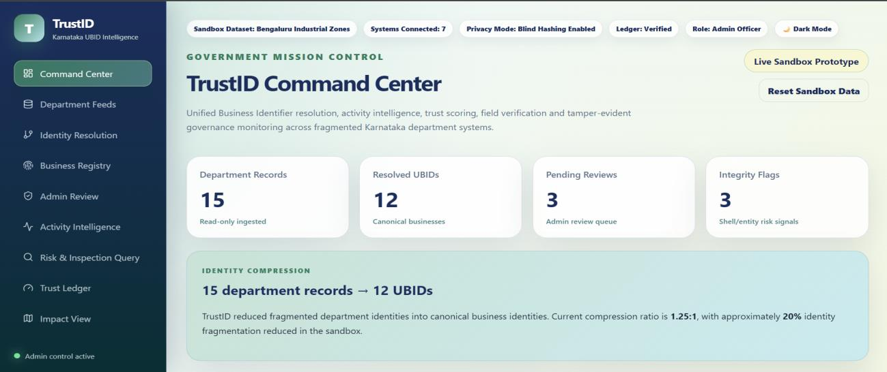
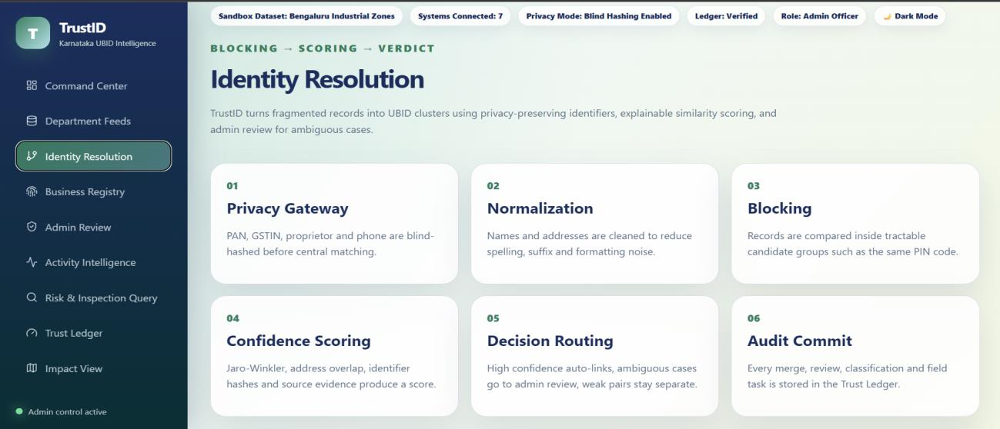
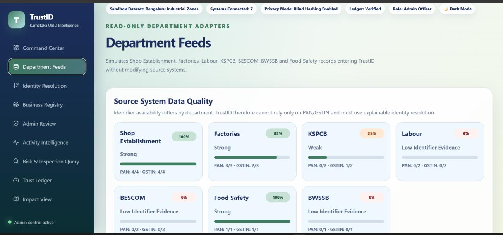
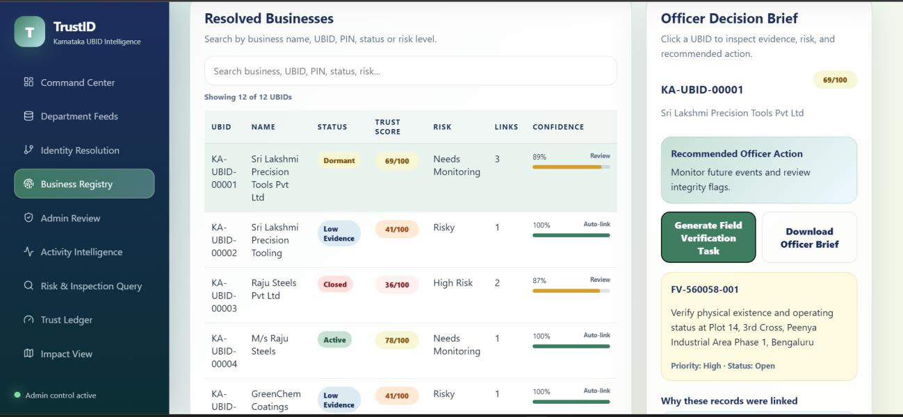
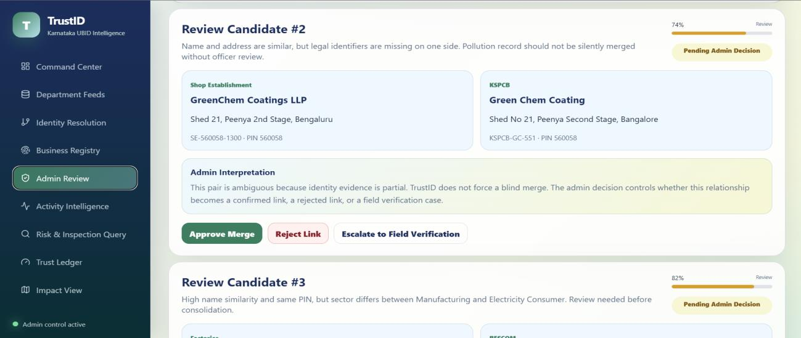
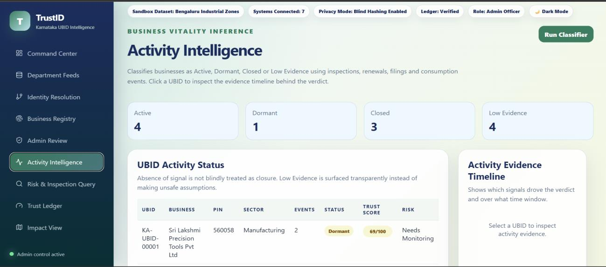
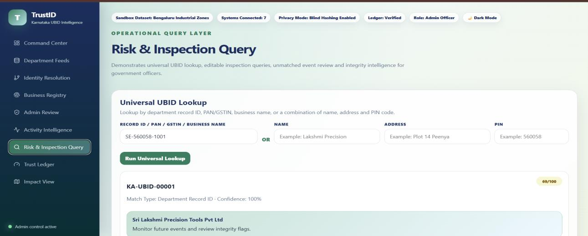
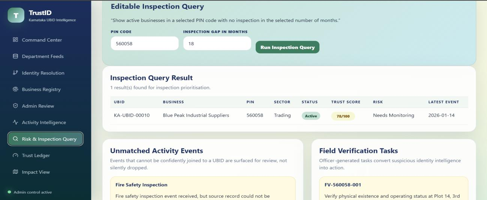
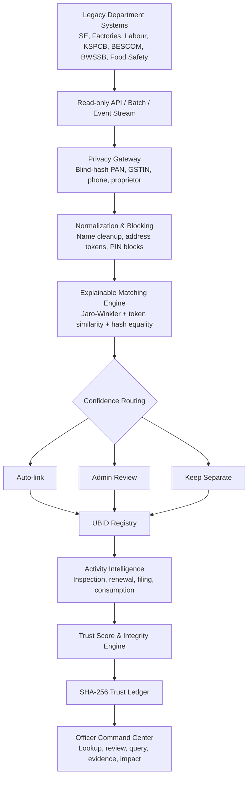
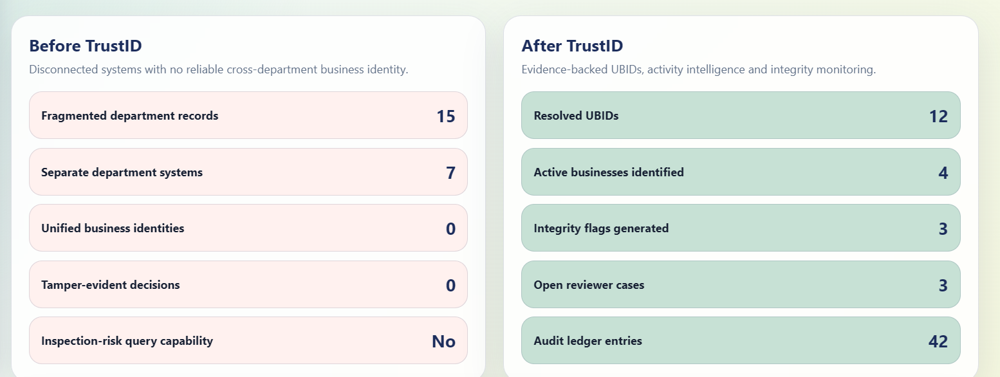

# 🔐TrustID

### Adversarially Robust Unified Business Identifier & Active Business Intelligence Platform

**A privacy-preserving, explainable and audit-defensible identity intelligence layer for Karnataka's business ecosystem.**

[](https://trust-id-ubid-intelligence.vercel.app/)
[](https://trustid-ubid-intelligence.onrender.com/api/health)
[](#recognition)

<br/>


<br/>

**Independently designed and built by [Agrima Saxena](https://github.com/agrima08s010315) as a solo participant for the AI for Bharat Hackathon — Theme 1: Unified Business Identifier and Active Business Intelligence by Karnataka Commerce & Industry.**

---

## 🏆 Recognition

> **Selected among the Top 50 teams across India from 1,000+ submissions.**

TrustID was independently developed as a **solo project** for the national-level **AI for Bharat Hackathon**, organized by the **PanIIT Bangalore Alumni Association** in association with the **Government of Karnataka**.

The project addressed **Theme 1 — Unified Business Identifier and Active Business Intelligence**, proposed by Karnataka Commerce & Industry.

---

## 🚀 What TrustID Does

Karnataka's business-facing regulatory ecosystem spans **40+ independent department systems**, including:

- Shop Establishment
- Factories
- Labour
- KSPCB
- BESCOM
- BWSSB
- Fire
- Food Safety
- local bodies

These systems use different schemas, department-specific record IDs, and inconsistent free-text names and addresses.

The same real-world business may therefore appear as:

```text
Shop Establishment  -> Sri Lakshmi Precision Tools Pvt Ltd
Factories           -> S L Precision Tools Private Limited
KSPCB               -> Lakshmi Precision Tools
Labour              -> Sri Lakshmi Precision Tooling
```

Without a trusted join key, officers cannot reliably answer:

- Which records belong to the same real-world business?
- Is the business active, dormant, closed, or simply missing evidence?
- Which active businesses have not been inspected recently?
- Is identity fragmentation accidental or potentially adversarial?
- Why were two records linked?
- Can an automated linkage decision survive audit?

**TrustID treats this as an identity, privacy, explainability, and integrity problem — not merely a data-cleaning task.**

---

## 🖥️ Product at a Glance



| Prototype Signal | Result |
|---|---:|
| Department systems simulated | **7** |
| Synthetic department records | **15** |
| Resolved UBIDs | **12** |
| Identity fragmentation reduced | **20%** |
| Universal lookup layer | **1** |
| Tamper-evident trust ledger | **SHA-256 hash chained** |

> The current deployment uses deterministic synthetic data so the complete demo remains safe, reproducible, and instantly resettable.

---

## 🧠 Identity Resolution

TrustID ingests department records in read-only mode, protects sensitive identifiers, normalizes names and addresses, compares candidate records, and assigns one canonical UBID to records representing the same real-world business.

```text
Department Records
      |
      v
Privacy Gateway
      |
      v
Normalization
      |
      v
PIN-Based Blocking
      |
      v
Similarity + Identifier Checks
      |
      v
Confidence Score
      |
      v
Decision Routing
      |
      +------ High Confidence ------> Auto-Link
      |
      +------ Medium Confidence ----> Human Review
      |
      +------ Low Confidence -------> Keep Separate
      |
      v
UBID Registry
      |
      v
Audit Commit
```

### Confidence Routing

| Confidence | Decision |
|---|---|
| `>= 0.90` or PAN/GSTIN anchor match | Auto-link |
| `0.60 - 0.89` | Human review |
| `< 0.60` | Keep separate |

**Design principle:** a wrong merge is more costly than a missed merge.

---

## 🔎 Explainable Matching



The matching preview exposes the evidence behind each linkage decision.

Signals include:

- PAN blind-hash equality
- GSTIN blind-hash equality
- phone blind-hash equality
- proprietor blind-hash equality
- Jaro-Winkler business-name similarity
- address-token overlap
- PIN-code consistency
- sector signals
- final confidence score
- routing outcome

No black-box merge is silently accepted.

---

## 🔐 Privacy-Preserving Design

Sensitive identifiers are transformed before reaching the central matching logic.

Examples include:

```text
PAN
GSTIN
Phone
Proprietor Identifier
```

These fields are blind-hashed at the ingestion boundary.

The central matcher can therefore compare equality without operating directly on raw identifiers.

---

## 🧩 Department Data Quality



TrustID makes data-quality issues visible before matching begins.

The platform can surface:

- incomplete identifiers
- inconsistent business names
- address variation
- missing department fields
- fragmented record coverage

This allows poor-quality source data to be treated as an explicit signal rather than hidden inside the matching process.

---

## 🗂️ UBID Registry



Each canonical business profile can include:

- canonical UBID
- linked department records
- identity confidence
- activity status
- trust score
- risk level
- integrity flags
- activity evidence
- recommended officer action

---

## 👤 Human-in-the-Loop Review



Ambiguous matches are routed to an officer instead of being merged automatically.

Reviewers can:

- approve a merge
- reject a merge
- escalate a case
- reopen a completed decision

**The decision is reversible; the history is not erasable.**

---

## 📈 Active Business Intelligence

After UBIDs are created, TrustID joins activity signals such as:

- inspections
- renewals
- filings
- utility-consumption events
- regulatory interactions

A business can then be classified as:

- **Active** — recent, high-weight evidence exists
- **Dormant** — evidence exists but is weak or old
- **Closed** — closure evidence or very old/weak signals
- **Low Evidence** — insufficient confidently joined evidence

**Absence of signal is never blindly treated as closure.**



Every classification is backed by an evidence timeline showing:

- event source
- event date
- signal strength
- join confidence

---

## 🔍 Universal Lookup



Officers can search across fragmented department systems using:

```text
Department Record ID
PAN
GSTIN
Business Name
Name + Address + PIN
```

This creates one lookup layer across previously disconnected records.

---

## 🧭 Inspection Intelligence



A flagship query is:

```text
Show active businesses in PIN 560058
with no inspection in the last 18 months.
```

The PIN code and inspection-gap window are editable.

This turns identity resolution into operational intelligence rather than stopping at record linkage.

---

## 🛡️ Adversarial Fragmentation Detection

TrustID does not assume all fragmentation is accidental.

The platform can flag patterns such as multiple differently named businesses sharing combinations of:

- proprietor identity
- phone
- PIN code
- address signals
- linked regulatory activity

These patterns may indicate:

- duplicate registrations
- poor source-data quality
- shell/front-entity behaviour
- regulatory arbitrage

Such signals are surfaced for human review rather than treated as automatic accusations.

---

## 🧾 Tamper-Evident Audit Trail

Important automated and human actions are committed to a SHA-256 hash chain.

```text
previous_hash
      +
event_type
      +
actor
      +
payload
      +
timestamp
      |
      v
current_hash
```

Changing a historical record breaks the chain.

This makes tampering detectable.

---

## 🏗️ Architecture



---

## ⚙️ Key Engineering Decisions

| Challenge | TrustID Approach |
|---|---|
| Legacy systems cannot be modified | Non-intrusive read-only middleware |
| Raw PII should not reach central intelligence services | Blind hashing at the ingestion boundary |
| Incorrect merges create high regulatory risk | Conservative thresholds + human review |
| Decisions must be explainable | Visible feature scores + evidence trails |
| Decisions must be reversible | Reopenable reviewer workflow |
| Historical decisions must remain defensible | Tamper-evident SHA-256 audit chain |
| Missing events must not disappear | Unmatched-event review queue |
| Fragmentation may be deliberate | Integrity and fragmentation scans |

---

## 🛠️ Tech Stack

| Layer | Technology |
|---|---|
| Frontend | React 18, Vite |
| UI | Custom CSS variables, responsive light/dark interface |
| Charts | Recharts |
| Backend | Node.js, Express |
| Prototype Data | Deterministic in-memory sandbox |
| Entity Resolution | Custom Jaro-Winkler, token similarity, weighted deterministic scoring |
| Privacy | CryptoJS SHA-256 blind hashing |
| Auditability | SHA-256 hash-chained ledger |
| Frontend Deployment | Vercel |
| Backend Deployment | Render |
| Production Path | PostgreSQL, Kafka, OpenSearch, KMS/HSM, distributed matching workers |

---

## 📡 API Surface

| Method | Endpoint | Purpose |
|---|---|---|
| `GET` | `/api/health` | Backend health check |
| `POST` | `/api/admin/reset` | Reset deterministic sandbox state |
| `GET` | `/api/dashboard` | Command Center KPIs |
| `GET` | `/api/ingestion` | Department feeds and quality metrics |
| `GET` | `/api/ubids` | List resolved UBIDs |
| `GET` | `/api/ubids/:ubid` | Business profile and evidence brief |
| `POST` | `/api/ubids/:ubid/field-verification` | Create field-verification task |
| `GET` | `/api/reviewer` | Ambiguous-match queue |
| `POST` | `/api/reviewer/:id/decision` | Merge, reject, or escalate |
| `POST` | `/api/reviewer/:id/reopen` | Reopen a completed decision |
| `GET` | `/api/activity` | Activity classifications |
| `GET` | `/api/activity/unmatched` | Unmatched activity events |
| `GET` | `/api/lookup` | Universal identity lookup |
| `GET` | `/api/query/flagship` | Inspection-gap intelligence |
| `GET` | `/api/query/integrity-flags` | Integrity risks |
| `GET` | `/api/audit` | Ledger and chain verification |
| `GET` | `/api/impact` | Before/after governance impact |

---

## 📁 Repository Structure

```text
TrustID-UBID-Intelligence/
├── backend/
│   ├── src/
│   │   └── server.js
│   ├── package.json
│   └── package-lock.json
│
├── frontend/
│   ├── src/
│   │   ├── components/
│   │   ├── pages/
│   │   ├── api.js
│   │   ├── App.jsx
│   │   └── styles.css
│   ├── index.html
│   ├── vite.config.js
│   └── package.json
│
├── trustid-readme-assets/
└── README.md
```

---

## ⚙️ Running Locally

### Requirements

```text
Node.js 18+
npm
```

### 1. Clone the Repository

```bash
git clone https://github.com/agrima08s010315/TrustID-UBID-Intelligence.git
cd TrustID-UBID-Intelligence
```

### 2. Start the Backend

```bash
cd backend
npm install
npm run dev
```

Backend:

```text
http://localhost:5000
```

### 3. Start the Frontend

Open another terminal:

```bash
cd frontend
npm install
npm run dev
```

Create:

```text
frontend/.env
```

with:

```env
VITE_API_BASE_URL=http://localhost:5000
```

Start the frontend:

```bash
npm run dev
```

Open:

```text
http://localhost:5173
```

---

## ☁️ Deployment

| Component | Platform | URL |
|---|---|---|
| Frontend | Vercel | [Open TrustID](https://trust-id-ubid-intelligence.vercel.app/) |
| Backend | Render | [API Health](https://trustid-ubid-intelligence.onrender.com/api/health) |

The free Render instance may sleep during periods of inactivity, so the first request after an idle period can take longer.

---

## 📊 Prototype Impact



TrustID demonstrates how fragmented departmental records can become:

- canonical business identities
- evidence-backed activity classifications
- explainable review workflows
- integrity and shell-entity alerts
- field-verification tasks
- cross-department lookup
- auditable governance intelligence

---

## 🌱 Production Roadmap

```text
Phase 1 — Controlled Sandbox Pilot
2 PIN codes
4-7 departments
Synthetic/scrambled data
Officer validation

Phase 2 — Department Integration
Read-only adapters
PostgreSQL persistence
RBAC
Maker-checker workflows

Phase 3 — Statewide Scale
40+ adapters
Kafka event streams
OpenSearch
Distributed matching workers

Phase 4 — Advanced Intelligence
Kannada-English normalization
Graph analytics
Calibrated thresholds
Officer query assistant
```

Planned directions include:

- HMAC-SHA256 with KMS/HSM-managed secrets
- Bloom-filter-based privacy-preserving fuzzy linkage
- Kannada transliteration
- role-based access control
- maker-checker workflows
- PostgreSQL persistence
- Kafka event streaming
- OpenSearch
- distributed matching workers
- graph-based shell-network detection
- officer query assistant

---

## 🎯 What This Project Demonstrates

TrustID brings together several engineering concerns:

- entity resolution
- privacy-preserving identifier matching
- explainable scoring
- human-in-the-loop review
- auditability
- API design
- full-stack development
- integrity analysis
- decision-support workflows
- cloud deployment

---

## ⚠️ Scope

TrustID is a **prototype decision-support system built using synthetic data**.

It does not represent an operational Government of Karnataka platform and should not be interpreted as a production deployment, certification, or government endorsement.

---

## 👩‍💻 Author

### Agrima Saxena

**Solo Developer · Full-Stack Engineering · Entity Resolution · Cybersecurity · AI & Data Systems**

<table>
<tr>

<td width="60">
<a href="https://www.linkedin.com/in/agrima-saxena-142960426/" title="LinkedIn">

</a>
</td>

<td width="60">
<a href="mailto:agrimalc@gmail.com" title="Email">

</a>
</td>

<td width="60">
<a href="https://github.com/agrima08s010315" title="GitHub">

</a>
</td>

</tr>
</table>

<a href="https://trust-id-ubid-intelligence.vercel.app/">

</a>

<a href="https://github.com/agrima08s010315/TrustID-UBID-Intelligence">

</a>

*Selected among the Top 50 teams nationwide at the AI for Bharat Hackathon 2026, co-presented by PAN IIT Bangalore Alumni Association and Government of Karnataka, for independently building TrustID as a solo participant.*

⭐ **If you found the project useful or interesting, consider starring the repository.**

---

### Karnataka does not just need more data. It needs a trusted join key.

**TrustID creates that join key without modifying legacy systems, exposing raw PII, or making silent black-box decisions.**