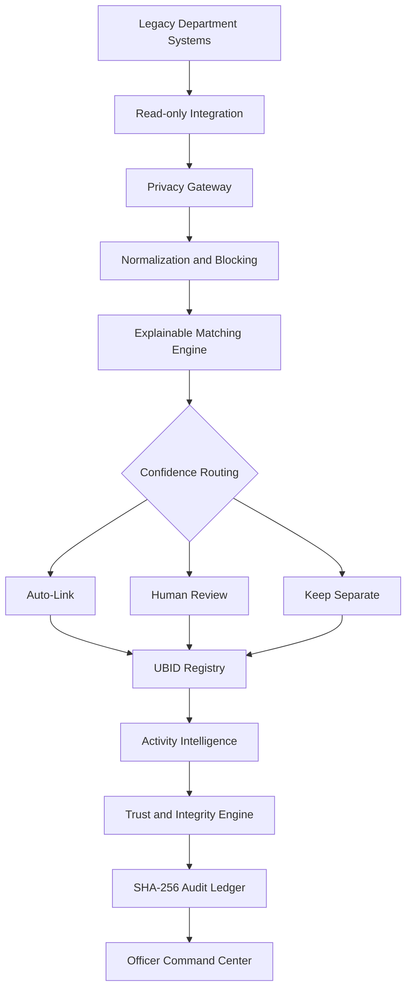

# 🔐 TrustID

### Unified Business Identifier & Active Business Intelligence Platform

TrustID is a privacy-preserving and explainable identity-intelligence platform designed to connect fragmented business records across government departments without requiring legacy systems to be rewritten.

It combines **entity resolution, privacy-preserving identifier matching, human review, activity intelligence, auditability, and cross-department lookup** into one workflow.

[](https://trust-id-ubid-intelligence.vercel.app/)
[](https://trustid-ubid-intelligence.onrender.com/api/health)
[](https://github.com/agrima08s010315/TrustID-UBID-Intelligence)


`React` `Node.js` `Express` `Entity Resolution` `SHA-256` `Human-in-the-Loop` `Vercel` `Render`

## 🚀 What TrustID Does

Karnataka's business ecosystem spans many independent department systems.

The same real-world business may appear under different names, addresses, identifiers, and record formats across multiple databases.

For example:

```text
Shop Establishment  -> Sri Lakshmi Precision Tools Pvt Ltd
Factories           -> S L Precision Tools Private Limited
KSPCB               -> Lakshmi Precision Tools
Labour               -> Sri Lakshmi Precision Tooling
```

TrustID creates a shared identity layer that can answer:

- which records belong to the same real-world business
- whether a business appears active, dormant, closed, or low-evidence
- which businesses have missing or outdated inspections
- whether identity fragmentation looks accidental or suspicious
- why two records were linked
- whether a historical decision was modified

The project treats identity resolution as a **privacy, explainability, integrity, and governance problem**, not only a fuzzy-matching problem.

## 🏆 Recognition

TrustID was selected among the **Top 50 teams across India** in the AI for Bharat Hackathon.

The project was built independently as a solo submission for the Unified Business Identifier and Active Business Intelligence theme.

## 🖥️ Product


The command center brings together:

- department ingestion health
- resolved business identities
- activity status
- integrity signals
- officer review tasks
- inspection priorities
- audit events

## 📊 Prototype Snapshot

| Signal | Result |
|---|---:|
| Department systems simulated | **7** |
| Synthetic department records | **15** |
| Resolved UBIDs | **12** |
| Identity fragmentation reduced | **20%** |
| Universal lookup layer | **1** |
| Audit mechanism | **SHA-256 hash chain** |

The current deployment uses deterministic synthetic data so the demo remains safe, reproducible, and resettable.

## 🧠 Identity Resolution

TrustID creates a canonical Unified Business Identifier for records that likely refer to the same real-world business.

The matching flow is:

```text
Department Records
      |
      v
Privacy Gateway
      |
      v
Normalization
      |
      v
PIN-Based Blocking
      |
      v
Similarity + Identifier Checks
      |
      v
Confidence Score
      |
      v
Decision Routing
      |
      +------ High Confidence ------> Auto-Link
      |
      +------ Medium Confidence ----> Human Review
      |
      +------ Low Confidence -------> Keep Separate
      |
      v
UBID Registry
      |
      v
Audit Commit
```

### Confidence Routing

| Confidence | Decision |
|---|---|
| `>= 0.90` or strong PAN/GSTIN anchor | Auto-link |
| `0.60 - 0.89` | Human review |
| `< 0.60` | Keep separate |

The design is intentionally conservative because a false merge can be more damaging than a missed merge.

## 🔎 Explainable Matching


The matching preview exposes the evidence behind each linkage decision.

Signals include:

- PAN blind-hash equality
- GSTIN blind-hash equality
- phone blind-hash equality
- proprietor blind-hash equality
- Jaro-Winkler business-name similarity
- address-token overlap
- PIN-code consistency
- sector information
- final confidence score

The system does not silently accept a black-box merge.

## 🔐 Privacy-Preserving Design

Sensitive identifiers are transformed before they reach the central matching logic.

Examples include:

```text
PAN
GSTIN
Phone
Proprietor Identifier
```

These values are blind-hashed at the ingestion boundary.

The matcher can therefore compare equality without requiring the central intelligence layer to operate directly on raw identifiers.

## 🧩 Department Data Quality


TrustID makes data-quality issues visible before entity matching begins.

The dashboard can surface:

- incomplete identifiers
- inconsistent business names
- address variation
- missing department fields
- fragmented record coverage

## 🗂️ UBID Registry


Each resolved business profile can contain:

- canonical UBID
- linked department records
- identity confidence
- activity status
- trust score
- risk level
- integrity flags
- activity evidence
- recommended officer action

## 👤 Human-in-the-Loop Review


Ambiguous matches are routed to an officer instead of being merged automatically.

Reviewers can:

- approve a merge
- reject a merge
- escalate a case
- reopen a completed decision

The current decision can change, but the historical record remains visible.

## 📈 Active Business Intelligence

After identities are resolved, TrustID joins activity events such as:

- inspections
- renewals
- filings
- utility consumption
- regulatory interactions

A business can then be classified as:

- **Active**
- **Dormant**
- **Closed**
- **Low Evidence**


The classification is supported by an evidence timeline containing:

- source
- event date
- signal strength
- join confidence

Missing evidence is not automatically treated as closure.

## 🔍 Universal Lookup


Officers can search across fragmented systems using:

```text
Department Record ID
PAN
GSTIN
Business Name
Name + Address + PIN
```

This creates one lookup layer across previously disconnected records.

## 🧭 Inspection Intelligence


An example query is:

```text
Show active businesses in PIN 560058
with no inspection in the last 18 months.
```

Both the PIN code and inspection-gap period can be changed.

This turns identity resolution into operational intelligence rather than stopping at record linkage.

## 🛡️ Adversarial Fragmentation Detection

TrustID does not assume all fragmentation is accidental.

The platform can flag patterns such as multiple differently named businesses sharing combinations of:

- proprietor identity
- phone
- PIN code
- address signals
- linked regulatory activity

These patterns may indicate data-quality issues, duplicate registrations, or potential shell/front-entity behaviour that requires human review.

## 🧾 Tamper-Evident Audit Trail

Important automated and human actions are committed to a SHA-256 hash chain.

```text
previous_hash
      +
event_type
      +
actor
      +
payload
      +
timestamp
      |
      v
current_hash
```

Changing an older record breaks the chain.

This makes historical tampering detectable.

## 🏗️ Architecture



## ⚙️ Key Engineering Decisions

| Challenge | TrustID Approach |
|---|---|
| Legacy systems cannot be rewritten | Read-only middleware |
| Raw identifiers should not reach the central matcher | Blind hashing |
| Incorrect merges create regulatory risk | Conservative confidence thresholds |
| Ambiguous matches need oversight | Human review |
| Decisions should be explainable | Visible feature scores |
| Decisions may need correction | Reopenable workflow |
| Historical actions must remain defensible | SHA-256 hash chain |
| Missing events should remain visible | Unmatched-event queue |
| Fragmentation may be deliberate | Integrity and network scans |

## 🛠️ Tech Stack

| Layer | Technology |
|---|---|
| Frontend | React 18, Vite |
| UI | Custom CSS, responsive light/dark interface |
| Charts | Recharts |
| Backend | Node.js, Express |
| Prototype Data | Deterministic in-memory sandbox |
| Entity Resolution | Jaro-Winkler, token similarity, weighted scoring |
| Privacy | SHA-256 blind hashing |
| Auditability | SHA-256 hash-chained ledger |
| Frontend Deployment | Vercel |
| Backend Deployment | Render |
| Production Path | PostgreSQL, Kafka, OpenSearch, KMS/HSM |

## 📡 API Surface

| Method | Endpoint | Purpose |
|---|---|---|
| `GET` | `/api/health` | backend health check |
| `POST` | `/api/admin/reset` | reset deterministic sandbox |
| `GET` | `/api/dashboard` | command-center metrics |
| `GET` | `/api/ingestion` | department feeds |
| `GET` | `/api/ubids` | list resolved UBIDs |
| `GET` | `/api/ubids/:ubid` | business profile |
| `POST` | `/api/ubids/:ubid/field-verification` | create field-verification task |
| `GET` | `/api/reviewer` | review queue |
| `POST` | `/api/reviewer/:id/decision` | merge, reject, or escalate |
| `POST` | `/api/reviewer/:id/reopen` | reopen decision |
| `GET` | `/api/activity` | activity classifications |
| `GET` | `/api/activity/unmatched` | unmatched events |
| `GET` | `/api/lookup` | universal lookup |
| `GET` | `/api/query/flagship` | inspection-gap intelligence |
| `GET` | `/api/query/integrity-flags` | integrity alerts |
| `GET` | `/api/audit` | ledger and verification |
| `GET` | `/api/impact` | before/after impact |

## 📁 Repository Structure

```text
TrustID-UBID-Intelligence/
├── backend/
│   ├── src/
│   │   └── server.js
│   ├── package.json
│   └── package-lock.json
│
├── frontend/
│   ├── src/
│   │   ├── components/
│   │   ├── pages/
│   │   ├── api.js
│   │   ├── App.jsx
│   │   └── styles.css
│   ├── index.html
│   ├── vite.config.js
│   └── package.json
│
├── trustid-readme-assets/
└── README.md
```

## ⚙️ Running Locally

### Requirements

```text
Node.js 18+
npm
```

### 1. Clone the Repository

```bash
git clone https://github.com/agrima08s010315/TrustID-UBID-Intelligence.git
cd TrustID-UBID-Intelligence
```

### 2. Start the Backend

```bash
cd backend
npm install
npm run dev
```

Backend:

```text
http://localhost:5000
```

### 3. Start the Frontend

Open another terminal:

```bash
cd frontend
npm install
npm run dev
```

Create:

```text
frontend/.env
```

with:

```env
VITE_API_BASE_URL=http://localhost:5000
```

Start the frontend:

```bash
npm run dev
```

Open:

```text
http://localhost:5173
```

## ☁️ Deployment

| Component | Platform |
|---|---|
| Frontend | Vercel |
| Backend | Render |

### Live Frontend

[Open TrustID](https://trust-id-ubid-intelligence.vercel.app/)

### Backend Health

[Check API](https://trustid-ubid-intelligence.onrender.com/api/health)

The free Render instance may sleep during inactivity, so the first request after an idle period can take longer.

## 📊 Prototype Impact


The prototype demonstrates how fragmented department data can become:

- canonical business identities
- evidence-backed activity classifications
- explainable review workflows
- integrity alerts
- field-verification tasks
- cross-department lookup
- auditable governance intelligence

## 🌱 Production Roadmap

```text
Phase 1
Controlled sandbox pilot

Phase 2
Department integration

Phase 3
Statewide scale

Phase 4
Advanced intelligence
```

Planned directions include:

- PostgreSQL persistence
- Kafka event streams
- OpenSearch
- KMS/HSM-backed secrets
- HMAC-SHA256 identifier protection
- Bloom-filter-based privacy-preserving linkage
- Kannada-English normalization
- RBAC and maker-checker workflows
- distributed matching workers
- graph-based fragmentation analysis
- officer query assistant

## 🎯 What This Project Demonstrates

TrustID brings together several engineering concerns:

- entity resolution
- privacy-preserving matching
- explainable scoring
- human-in-the-loop review
- auditability
- API design
- full-stack development
- integrity analysis
- decision-support workflows
- cloud deployment

## ⚠️ Scope

TrustID is a **prototype decision-support system built with synthetic data**.

It does not represent an operational Government of Karnataka platform and should not be interpreted as production deployment, certification, or government endorsement.

## 👩‍💻 Author

### Agrima Saxena

**Solo Developer · Full-Stack Engineering · Entity Resolution · Cybersecurity · AI & Data Systems**

<table>
<tr>

<td width="60">
<a href="https://www.linkedin.com/in/agrima-saxena-142960426/" title="LinkedIn">

</a>
</td>

<td width="60">
<a href="mailto:agrimalc@gmail.com" title="Email">

</a>
</td>

<td width="60">
<a href="https://github.com/agrima08s010315" title="GitHub">

</a>
</td>

</tr>
</table>

<a href="https://trust-id-ubid-intelligence.vercel.app/">

</a>

<a href="https://github.com/agrima08s010315/TrustID-UBID-Intelligence">

</a>

<br><br>

⭐ **If you found the project useful or interesting, consider starring the repository.**